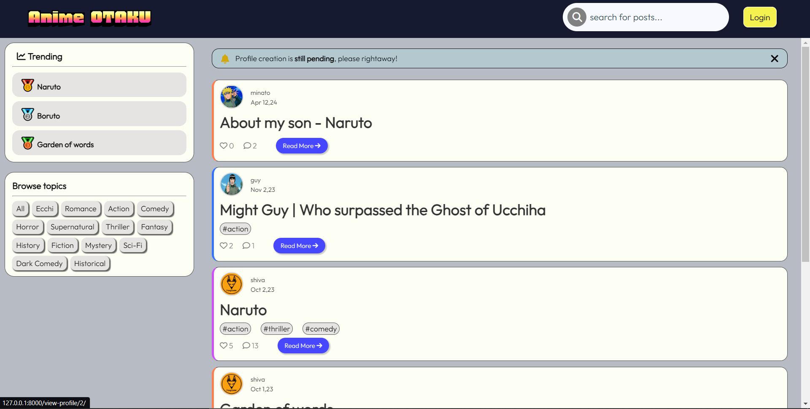
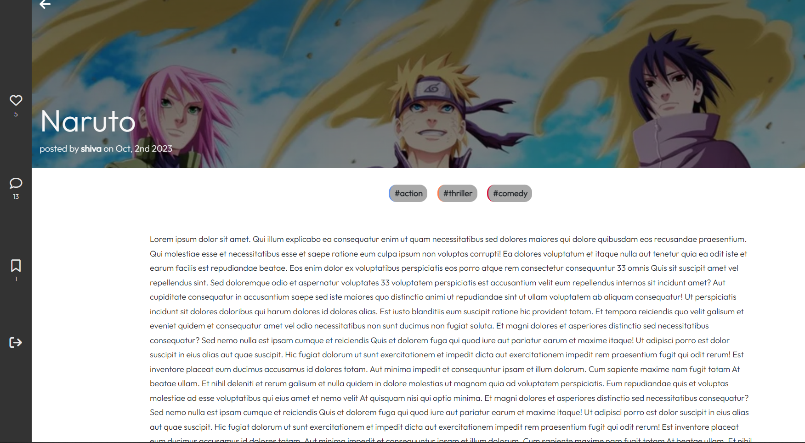
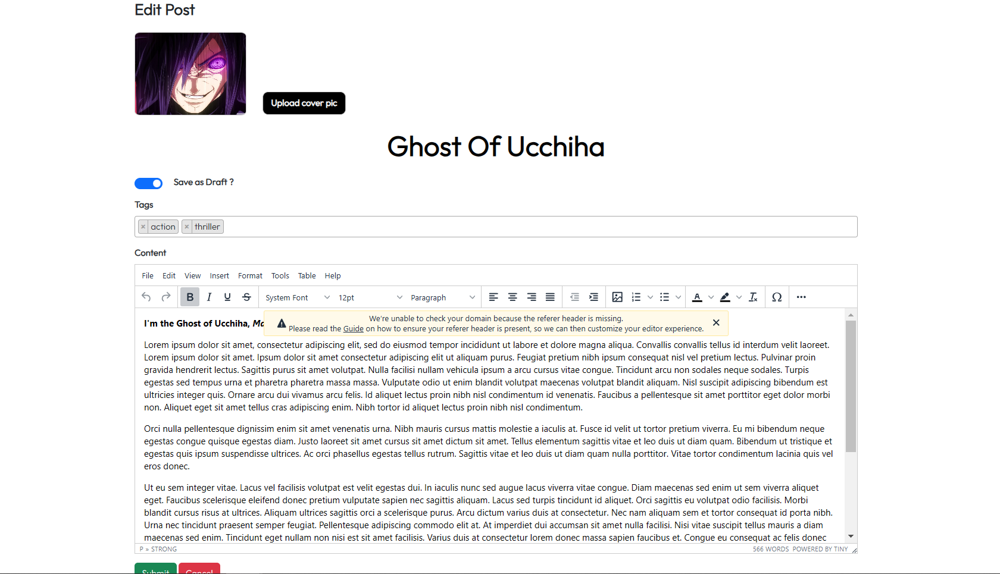
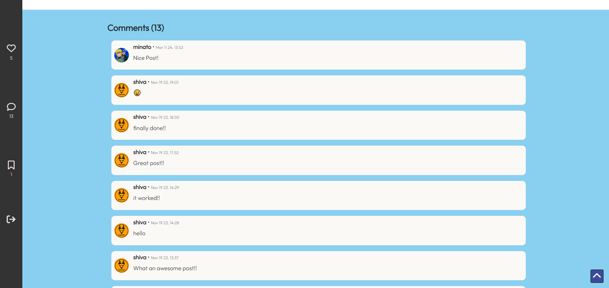
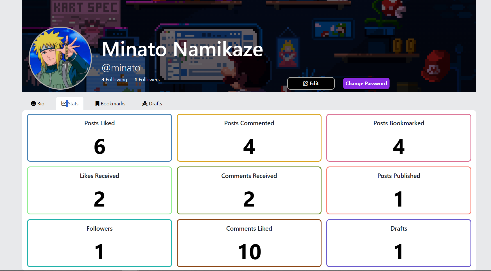

# DJ CRUD (a fully functional blogging platform)

A Django-based blogging platform that offers rich text editing, social interactions, and customizable user profiles. Users can create and publish posts, comment, like, and bookmark content, as well as follow other users. Real-time ranking of trending posts based on user interactions.

## 🚀 Features

- **Rich Text Editor**:
  - Integrated TinyMCE editor for a seamless writing experience, enabling text formatting, image insertion, and more.

- **User Authentication**:
  - Simple email-based account creation and verification process.
  - Users receive an account activation email, and clicking the activation link verifies the account.

- **Post Management**:
  - Users can create, edit, delete, and publish their posts.
  - Posts can be tagged for easy categorization (tags like genres).
  - Posts can be saved as drafts for later publication.

- **Post Interaction**:
  - Users can like and comment on posts, bookmark them for later reference, and like comments.
  - Only authenticated users can interact with posts.

- **Trending and Ranking Features**:
  - Top 3 trending posts are ranked in real time based on likes, comments, and bookmarks.
  - A section dedicated to trending tags, allowing users to browse by genre.

- **Dashboard**:
  - Each user has a dashboard displaying:
    - Number of posts written
    - Total likes and comments received
    - Bookmarks made
    - Followers and following count
    - Liked and commented posts

- **Profile Customization**:
  - Users can create a personal profile with a bio, profile picture, and cover picture.
  - Users can follow other authors and view a feed of posts from followed users.

- **Search and Filtering**:
  - Search functionality to filter posts by title, author, tags, or keywords within the content.

## 🛠️ Technologies Used

- **Backend**: Django (Python)
- **Database**: SQLite
- **Frontend**: HTML, CSS, JS, Bootstrap
- **Text Editor**: TinyMCE for rich text post creation
- **Other Features**: Email verification, user authentication, real-time rankings

## ⚙️ How It Works

1. **User Registration**:
   - Users register with their email and username.
   - A verification email with an activation link is sent.
   - Upon successful activation, users can start posting and interacting with content.

2. **Post Creation and Interaction**:
   - Posts are created using the TinyMCE editor, supporting formatted text, images, and tags.
   - Users can interact with posts via likes, comments, and bookmarks.
   - Users can publish posts immediately or save them as drafts for later.

3. **Real-Time Trending and Tag Filtering**:
   - Trending posts are displayed in real time on the main page.
   - Popular tags allow users to quickly filter posts based on their interests.

4. **User Dashboard and Profile**:
   - Each user has a personalized dashboard to track their post engagement and followers.
   - Users can customize their profile with a bio, profile picture, and cover photo.

## 📦 Setup Instructions

### 1. Clone the Repository
```bash
git clone git@github.com:sudocodedev/DJ_CRUD.git
cd DJ_CRUD
git checkout like_comment
```

### 2. Install Dependencies
Ensure Python is installed. Then run:
```bash
pip install -r requirements.txt
```

### 3. Configure Environment Variables
Set up the necessary environment variables in your `.env` file, including email settings for account verification.

### 4. Run Migrations
```bash
python manage.py migrate
```

### 5. Create a Superuser
```bash
python manage.py createsuperuser
```

### 6. Run the Development Server
```bash
python manage.py runserver
```

### 7. Access the App
Open your browser and go to `http://127.0.0.1:8000/` to start using the blogging application.

## 🖼️ Screenshots



*Main page with trending posts and tag filtering.*


*Main page with trending posts and tag filtering.*


*Main page with trending posts and tag filtering.*


*Main page with trending posts and tag filtering.*


*User dashboard showing post engagement stats.*
